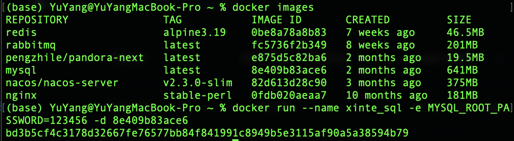
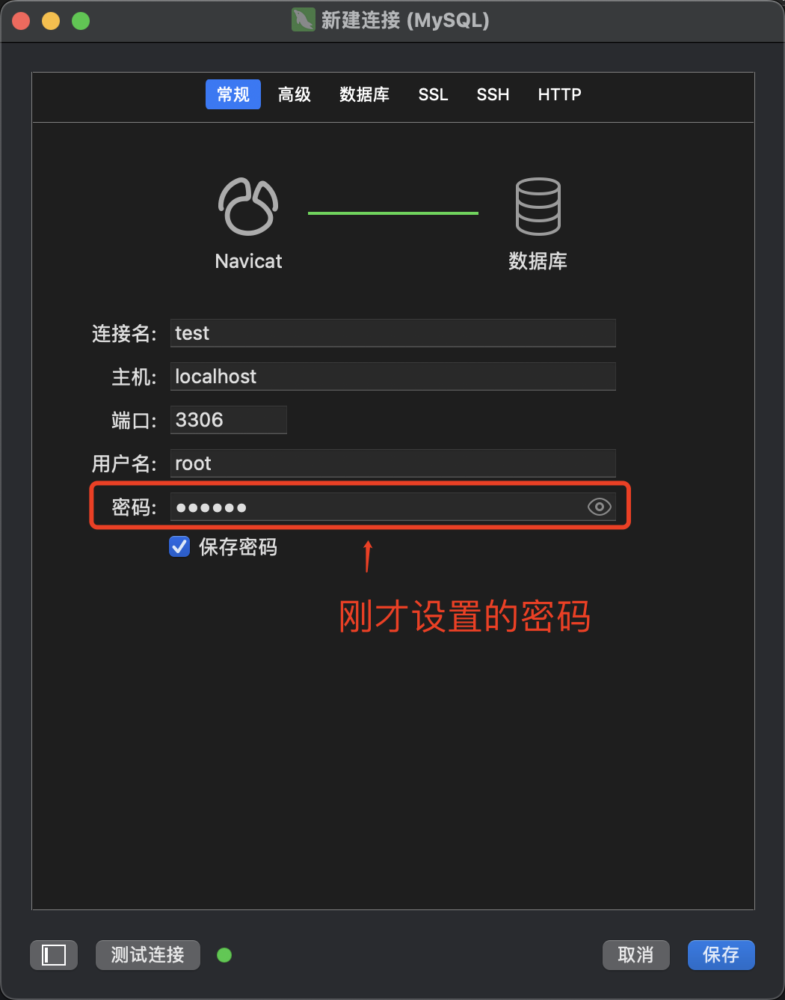
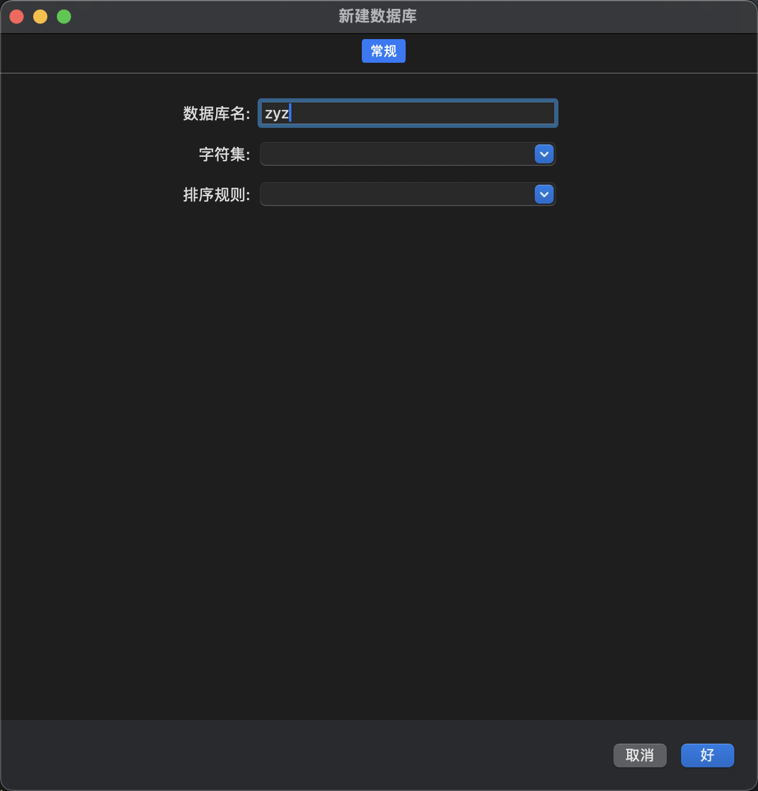
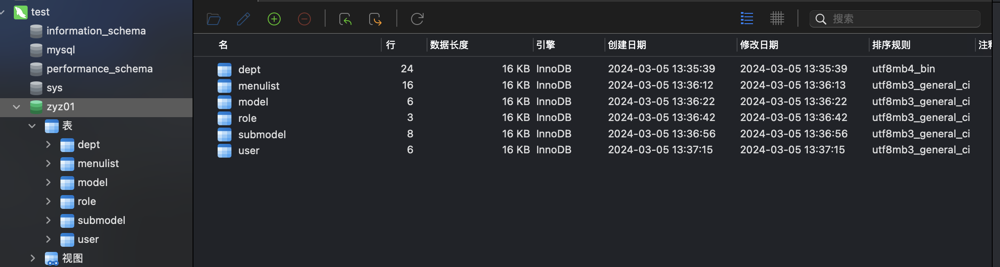
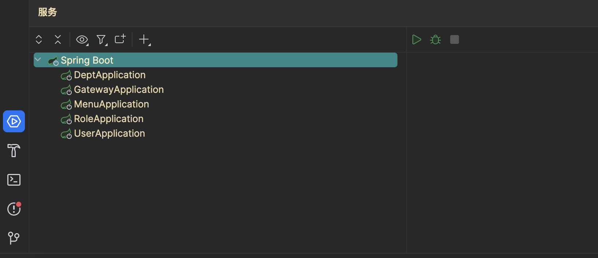
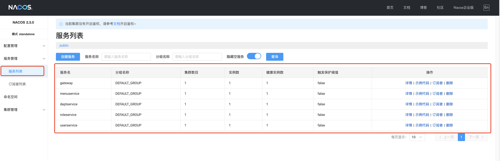

# 微服务版后端

我这边只给出docker版本的部署 非docker部署可自行下载各个工具并做配置修改。

## docker镜像列表

MAC INTEL CHIP、MAC APPLE CHIP和WINDOWS细节会有所不同，但大同小异 遇到问题一般均可百度得到

| 镜像  |      |
| ----- | ---- |
| redis |      |
| mysql |      |
| nacos |      |
| nginx |      |

可在docker客户端中配置镜像生成容器也可以在命令行中配置

## Docker mysql启动



```bash
docker images #获取到本地docker镜像列表
docker run -p 3306:3306 --name xinte_sql -e MYSQL_ROOT_PASSWORD=123456 -d 8e409b83ace6
# -p端口映射  --name 定义container名字 -e设置变量 -d后台运行 8e409b83ace6是镜像ID

```





然后往这个数据库里转存sql文件



## Docker Nacos启动

```shell
docker run --name nacos-quick -e MODE=standalone -p 8848:8848 -p 9848:9848 -d 82d613d28c90
```

```
yml 文件 nacos地址改成 127.0.0.1:8848
```



一键启动：

启动后查看nacos网址

```
http://127.0.0.1:8848/nacos/
```

查看服务列表



## Docker redis启动

```
docker run -p 6379:6379 -d 0be8a78a8b83
```

